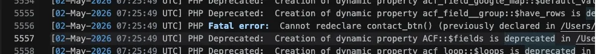
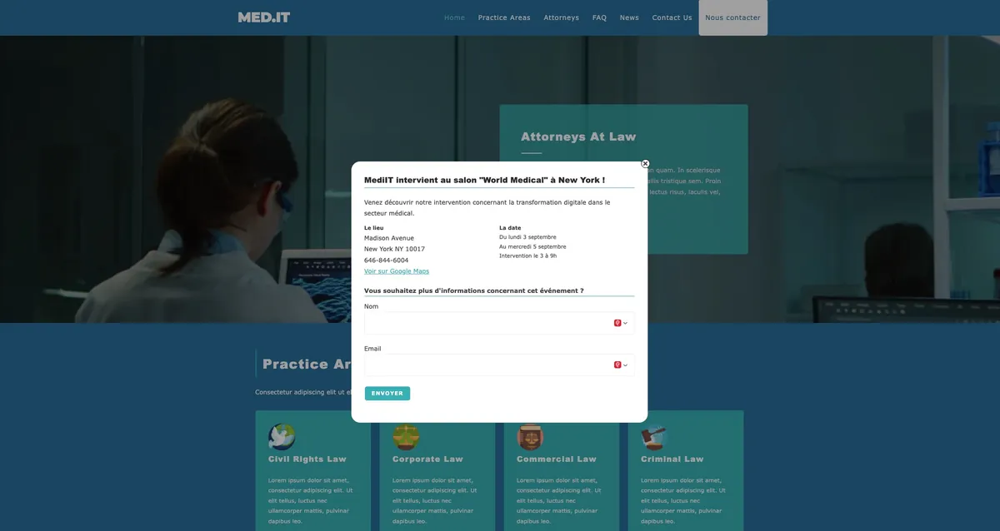
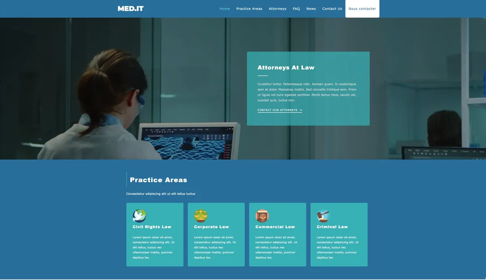
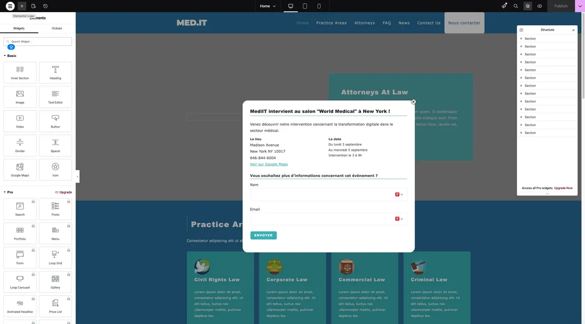
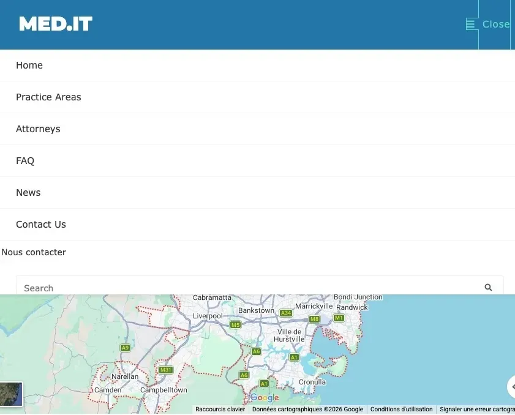
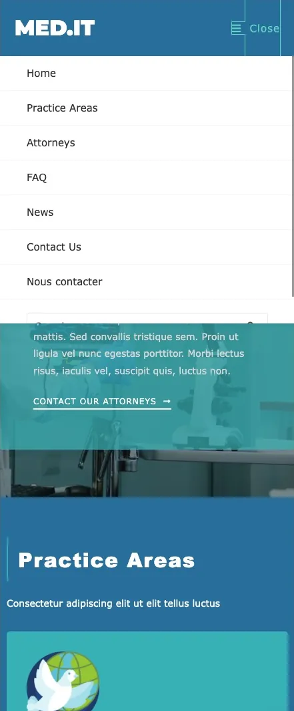
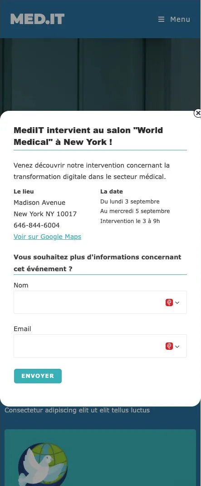

# MedIT : débogage et recette d'un site WordPress

> Projet 10 de la formation **Développeur WordPress (OpenClassrooms)**, réalisé en avril-mai 2026.
> Juliette Béthery · [Agence Bethauv](https://agence-bethauv.fr)

## Contexte

MedIT est une PME (fictive) qui conçoit des systèmes informatiques sur mesure pour le secteur médical. Une semaine avant un salon professionnel, son responsable marketing a voulu ajouter au site une **pop-up** pour annoncer l'événement et recueillir les e-mails des visiteurs intéressés.

Il n'a pas réussi à terminer ce module et **le site ne s'affichait plus**. Ma mission, en tant que développeuse WordPress freelance :

1. remettre le site en état de marche ;
2. corriger les anomalies qu'il avait signalées ;
3. tenir un **cahier de recette** pour valider chaque correction avec le client ;
4. le conseiller sur les **tests unitaires et fonctionnels** pour éviter que ces bugs ne reviennent sur ses autres projets.

**Environnement :** WordPress, thème OceanWP + thème enfant, Elementor, ACF, Contact Form 7, développement en local (Local), débogage avec Query Monitor et la console du navigateur, suivi des versions avec Git.

## Bugs corrigés

| # | Problème constaté | Cause | Correction | Commit |
|---|---|---|---|---|
| 1 | Erreur critique, le site ne s'affiche plus | Fonction `contact_btn()` déclarée deux fois (`functions.php` et `header.php`) | Suppression du doublon dans `header.php` | `a5ae5ee` |
| 2 | L'éditeur Elementor charge à l'infini | WordPress et extensions obsolètes par rapport à l'environnement | Mise à jour du cœur et des extensions | — |
| 3 | La pop-up ne se ferme pas | `$ is not a function` (jQuery en mode *noConflict*) + mauvais élément ciblé | Code encapsulé dans `(function($){…})(jQuery)` et ciblage de `.closest('.popup-overlay')` | `a5ae5ee` |
| 4 | Le formulaire n'apparaît pas dans la pop-up | `do_shortcode()` renvoie le formulaire sans l'afficher | Ajout de `echo` | `7f13e54` |
| 5 | Le lien Google Maps est vide | Le champ ACF « Lien » renvoie un tableau (url, title, target) | Utilisation de `$lien['url']` | `693e9bb` |
| 6 | Le bouton « Nous contacter » sort du menu | Lien injecté sans sa balise `<li>` | Ajout de `<li class="menu-item">` dans le filtre `wp_nav_menu_items` | `2641a2b` |
| 7 | Style du bouton Contact sur ordinateur | Couleur de lien non adaptée | Règle CSS dédiée au-delà de 768 px | `c7b7e64`, `6662722` |

Les commits cités viennent du dépôt de travail d'origine, qui n'est pas publié (il contenait la base de données du client).

J'ai aussi **allégé le site** en supprimant les thèmes inutilisés (Twenty Twenty-One, -Two, -Three).

### Exemples de corrections

**Fermeture de la pop-up** : dans WordPress, jQuery ne réserve pas le raccourci `$`.

```js
// Avant : $ is not a function
$('.popup-close').click(function () {
  $(this).parent().hide();
});

// Après
(function ($) {
  $('.popup-close').click(function () {
    $(this).closest('.popup-overlay').hide();
  });
})(jQuery);
```

**Lien Google Maps** : le champ ACF de type « Lien » renvoie un tableau.

```php
// Avant : href="Array"
<a href="<?php echo $lien; ?>">

// Après
<a href="<?php echo $lien['url']; ?>" target="_blank">
```

## Avant / après

**Avant : le site ne s'affiche plus.** Le journal d'erreurs PHP indique une fonction déclarée deux fois.



**Après : la pop-up fonctionne.** Le formulaire Contact Form 7 et le lien Google Maps s'affichent, et la croix ferme la fenêtre.



**Après : le menu est correct.** Une fois la pop-up fermée, le bouton « Nous contacter » est intégré au menu et mis en forme.



**Après : Elementor se charge.** L'éditeur s'ouvre de nouveau sur la page d'accueil.



**Menu mobile, avant et après.** Avant la correction, le lien « Nous contacter » sortait de la liste du menu, sans mise en forme. Après, c'est une entrée du menu comme les autres.

<p>
  
  
</p>

**Pop-up sur mobile.** La pop-up s'adapte à la largeur de l'écran.



## Contenu du dépôt

```
oceanwp-child-theme/   thème enfant corrigé (functions.php, header.php, style.css)
docs/                  cahier de recette + guide « tests unitaires et fonctionnels » remis au client
captures/              captures avant / après
```

Ce dépôt ne contient **que le code que j'ai écrit ou modifié**. Il ne contient ni le cœur de WordPress, ni les extensions tierces, ni la base de données, ni les fichiers de configuration.

## Livrables

- [Cahier de recette (PDF)](docs/cahier-de-recette-medit.pdf) : 7 tests, avec pour chacun le résultat constaté, le résultat attendu, le statut et le temps passé.
- [Guide tests unitaires et fonctionnels (PDF)](docs/tests-unitaires-fonctionnels-medit.pdf) : conseils rédigés pour un interlocuteur non technique.

## Pistes d'amélioration

Le périmètre de la mission était la correction des bugs. Pour une mise en production, j'irais plus loin :

- **Sécurité** : échapper toutes les sorties des champs ACF (`esc_html()`, `esc_url()`, `wp_kses_post()`) et ajouter `rel="noopener"` aux liens `target="_blank"` ;
- **Maintenabilité** : sortir le script de `header.php` pour le charger avec `wp_enqueue_script()`, et ne plus écrire en dur l'ID de la page (161) ni celui du formulaire (910) ;
- **Responsive** : sur mobile, la pop-up occupe toute la largeur et le bouton de fermeture, positionné en `right: -5px`, est à moitié hors de l'écran. Il faudrait ajouter une marge latérale (`width: calc(100% - 2rem)`) et placer la croix à l'intérieur de la fenêtre ;
- **Accessibilité** : transformer le `<span>` de fermeture en `<button>` avec un `aria-label`, permettre de fermer avec la touche Échap et garder le focus dans la pop-up ;
- **RGPD** : ajouter une case de consentement et un lien vers la politique de confidentialité dans le formulaire de collecte d'e-mails.
